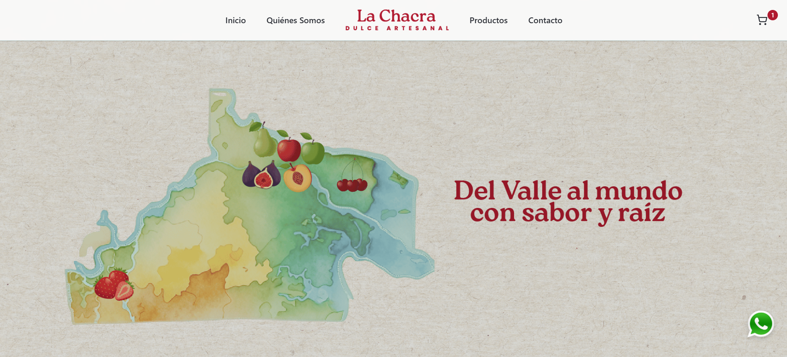
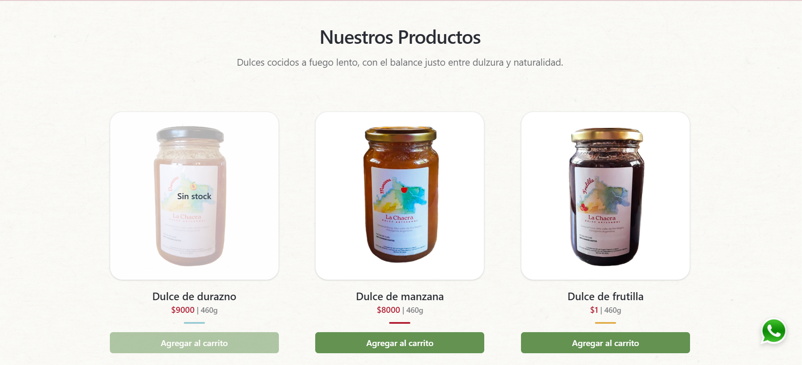
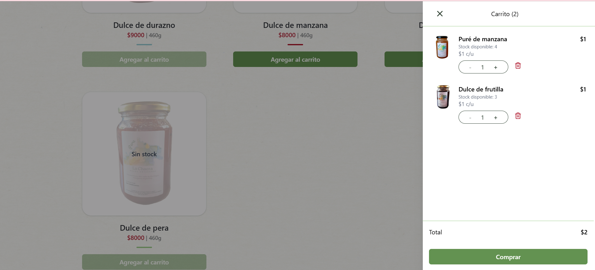
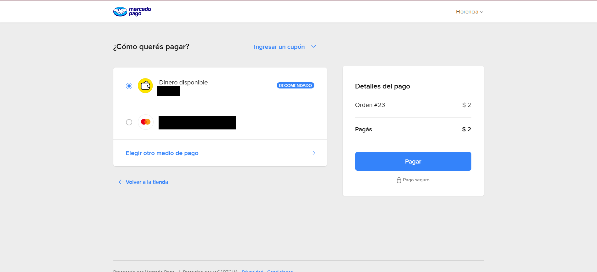

# La Chacra – Dulces Artesanales 🍬

> **ES** | E-commerce de productos regionales artesanales con experiencia de compra cuidada, carrito persistente, pagos integrados y panel de administración.
>
> **EN** | E-commerce for regional artisanal products, featuring a polished shopping experience, persistent cart, integrated payments, and an admin dashboard.

🔗 **Live demo:** [dulceslachacra.com](https://dulceslachacra.com)

---

## 🛠 Tech Stack

| Layer | Technologies |
|---|---|
| **Frontend** | Next.js 14 (App Router), React 18, TypeScript, Tailwind CSS, Framer Motion |
| **Backend** | Node.js, Express.js, REST API |
| **Database** | PostgreSQL |
| **Payments** | Mercado Pago SDK |
| **Email** | Resend (transactional) |
| **Storage** | AWS S3 |
| **Infra** | Railway, Docker, GitHub Actions |
| **Testing** | Vitest, Supertest, Prisma (test DB) |

---

## ✨ Features / Funcionalidades

**EN**
- Persistent cart via `localStorage`
- Real-time stock control
- Online payments with Mercado Pago
- Automatic order confirmation emails
- Admin panel (login-only, no public registration)
- Full product CRUD
- Order visualization
- Stock synced with the client's Google Sheets
- Toast notifications for key actions

**ES**
- Carrito persistente con `localStorage`
- Control de stock en tiempo real
- Pagos online con Mercado Pago
- Envío automático de emails de confirmación de pedido
- Panel de administración con login (sin registro público)
- CRUD completo de productos
- Visualización de órdenes
- Stock sincronizado con Google Sheets de la clienta
- Notificaciones de acciones con toasts

---

## 🔐 Admin Panel / Panel de Administración

**EN** — Access is restricted to a single login. No public registration. Includes product management, order history, and stock control.

**ES** — El acceso está restringido a un login único. Sin registro público. Incluye gestión de productos, historial de órdenes y control de stock.

---

## 🔗 Integrations / Integraciones

| Service | Purpose / Uso |
|---|---|
| **Mercado Pago** | Online payments / Pagos online |
| **Resend** | Transactional emails / Emails transaccionales |
| **AWS S3** | Image storage & delivery / Almacenamiento y entrega de imágenes |
| **Google Sheets** | Real-time stock sync / Stock sincronizado en tiempo real |

---

## 🧪 Testing

**EN** — Integration tests run against a real isolated database, with global mocks for all external services.

**ES** — Tests de integración sobre base de datos real aislada, con mocks globales para todos los servicios externos.

- **Framework:** Vitest + Supertest
- **DB:** Prisma (test environment)
- Mocks for / Mocks para: AWS S3, Resend, Mercado Pago
- Idempotent webhook tests / Tests de webhooks idempotentes
- DB reset between test suites / Reseteo de base de datos entre suites

```bash
npm run test:run
```

---

## ⚙️ CI/CD

**EN** — GitHub Actions runs the full test suite on every push to `main`/`develop` and on all pull requests targeting `main`. A PostgreSQL container is spun up automatically for each run.

**ES** — GitHub Actions ejecuta la suite completa de tests en cada push a `main`/`develop` y en todos los pull requests a `main`. Se levanta un contenedor de PostgreSQL automáticamente en cada ejecución.

---

## 🐳 Docker

```bash
# Build the image / Construir la imagen
docker build -t la-chacra-backend .
```

---

## 🚀 Getting Started / Instalación

```bash
# Clone the repo / Clonar el repositorio
git clone https://github.com/tu-usuario/la-chacra.git
cd la-chacra

# Install dependencies / Instalar dependencias
npm install

# Start development server / Iniciar servidor de desarrollo
npm run dev

# Build for production / Construir para producción
npm run build

# Run in production / Correr en producción
npm start

# Format with Prettier / Formatear con Prettier
npm run format
```

---

## 🎨 Design & UX / Diseño

**EN**
- Fully responsive: mobile, tablet, and desktop
- Custom UI/UX design
- Smooth, accessible animations (Framer Motion)
- Reusable components: Navbar, Footer, WhatsApp floating button
- Product photo editing for consistent visual identity
- Focused on a simple, clear purchase flow
- Accessibility best practices: descriptive alt text, semantic HTML, verified contrast ratios
- Basic SEO metadata via `app/layout.tsx`

**ES**
- Responsive completo: mobile, tablet y desktop
- Diseño UI/UX propio
- Animaciones suaves y accesibles (Framer Motion)
- Componentes reutilizables: Navbar, Footer, botón flotante de WhatsApp
- Edición de fotos de producto para identidad visual coherente
- Enfoque en una experiencia de compra simple y clara
- Buenas prácticas de accesibilidad: alt text descriptivo, HTML semántico, contraste revisado
- Metadata básica de SEO en `app/layout.tsx`

---

## 📷 Screenshots

| Home | Products / Productos |
|---|---|
|  |  |

| Cart / Carrito | Admin Panel |
|---|---|
|  |  |

| Mercado Pago ||
|---|---|
|  | |

---

## 📦 Deploy

**EN** — Backend and database deployed on **Railway**. Frontend live at [dulceslachacra.com](https://dulceslachacra.com) with a custom domain.

**ES** — Backend y base de datos desplegados en **Railway**. Frontend en producción en [dulceslachacra.com](https://dulceslachacra.com) con dominio propio.
